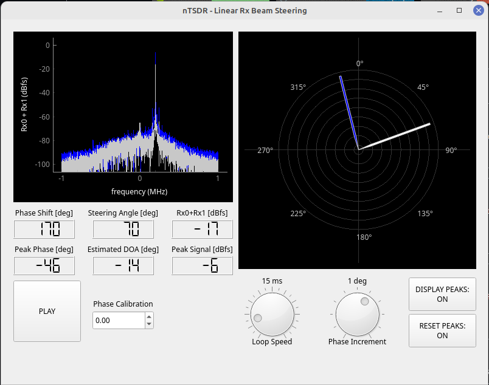

# PyQT GUI
This repository hosts information, resources, and code about the Pythonic GUI toolkit PyQT. This toolkit serves as the preferred GUI platform for a senior design project at Florida Atlantic University that focusses on the evaluation and implementation of off-the-shelf software-defined radios (SDRs). The main repository for hosting phased array beamforming code and resources can be found [here](https://github.com/ADolbyB/sdr-beamforming) under Joel Brigida, a group member for the project out of five.

<div align="center">
    <p>
        Rx Steering GUI made from QT Designer:
    </p>
<br>
</div>

## QT Designer Resources
QT Designer is a GUI development platform included in the QT package. QT also comes with an application development platform known as QT Creator that uses QT Designer as a sub-program, but for the purposes of this project, our group exclusively used the former. 
- [QT Homepage](https://www.qt.io/)
- [QT Designer Manual](https://doc.qt.io/qt-6/qtdesigner-manual.html)
- [QT Designer Tutorial Video by Tech with Tim](https://www.youtube.com/watch?v=FVpho_UiDAY)
- [QT GitHub](https://github.com/qt)

## PyQT and PyQTGraph Resources
PyQT is a Pythonic binding for the QT library and enables our project to remain Python-oriented. There are many versions of Pythonic bindings for QT, some under the alias 'PySide.' The differences between various PyQT versions and PySide are minimal and are often disregarded in any resource or discussion found online. Our project utilizes PyQT5. QT Designer exports files in a .ui format which can then be transformed into a Python file. This process can be done using this line of code:
```pyuic5 -x name_of_file.ui -o name_of_file.py```
- [PyQT Homepage](https://doc.qt.io/qtforpython-6/)
- [PyQT5 on PyPi](https://pypi.org/project/PyQt5/)
- [PyQT5 GitHub](https://github.com/PyQt5)
  
PyQTGraph is a graphics configuration library built from PyQT. Similarly to libraries such as [MatPlotLib](https://matplotlib.org/), PyQTGraph allows for the configuration, display, and updating of graphical widgets. This library is especially helpful for displayign beamforming metrics in a quick and continuous pace. A significant figure for our project by the name of [Jon Kraft](https://github.com/jonkraft) notes PyQTGraph's performance to be particularly beneficial for SDR beamforming algorithms, as referenced in some of his code.
- [PyQTGraph Website](https://www.pyqtgraph.org/)
- [PyQTGraph Documentation](https://pyqtgraph.readthedocs.io/en/latest/)
- [PyQTGraph GitHub](https://github.com/pyqtgraph)
